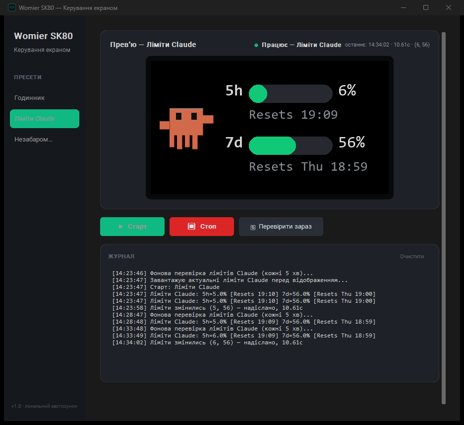
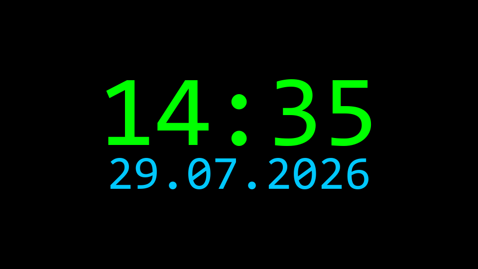
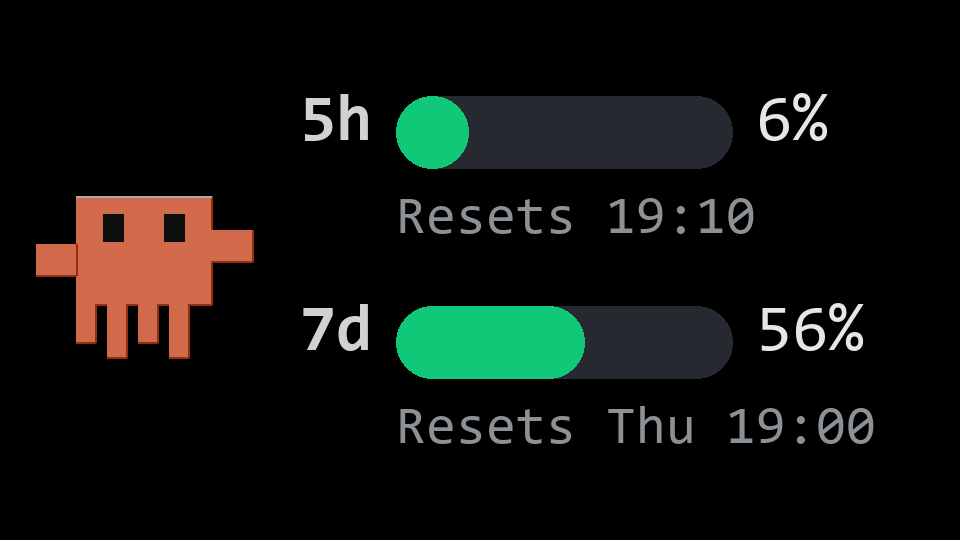

# Womier SK80 — власний контент на вбудований екран

[](LICENSE)


[](https://github.com/Igor-Shpetnyi/womier-sk80-screen/releases/latest)
[](https://github.com/Igor-Shpetnyi/womier-sk80-screen/actions/workflows/build.yml)

Реверс-інжиніринг HID-протоколу вбудованого TFT-екрана механічної клавіатури **Womier SK80**
(і, ймовірно, інших клавіатур на тому ж SONiX-чіпі, `VID_05AC&PID_024F`) — і невеликий
GUI-застосунок, що показує на цьому екрані живий контент напряму, в обхід фірмового Windows-драйвера,
який уміє лише заливати статичні GIF.



*Реальний скріншот роботи GUI — пресет "Ліміти Claude" з живими даними та журналом подій.*

|                                            |                                                    |
|--------------------------------------------|----------------------------------------------------|
|        |  |
| Пресет "Годинник"                           | Пресет "Ліміти Claude" (з анімованим маскотом)      |

*(реальний рендер, як він виглядає на пристрої — 160×90, тут збільшено ×6 для наочності)*

## Навіщо це

Офіційний драйвер вміє лише заливати статичний GIF через свій UI. Проаналізувавши USB-трафік
(Wireshark + USBPcap) і розібравши формат кадру та командний handshake, стало можливим малювати
на екрані **будь-що** — живий годинник, дані з довільного API тощо — без драйвера взагалі.
Повний хід дослідження й усі знахідки — у [docs/PROTOCOL.md](docs/PROTOCOL.md).

## Можливості

- **Годинник** — синхронізований з початком хвилини (виміряна точність: +0.03…+0.05с від `:00`),
  з вибором кольору (5 готових варіантів + свій).
- **Ліміти Claude** — 5-годинний і тижневий ліміт використання Claude.ai/Code, з анімованим
  векторним маскотом, що біжить (10-кадровий цикл), і конкретним часом скидання під кожним баром
  ("Resets 19:10" / "Resets Thu 19:00" — навмисно час, а не таймер зворотного відліку: кадр
  оновлюється лише коли дані реально змінились, тож таймер застарівав би між відправками). Дані
  читаються з власного локального OAuth-токена Claude Code — це **не** ліміти Anthropic API.
  Розумне оновлення: фонова перевірка кожні 5 хв, надсилання на екран лише коли значення реально
  змінились (щоб не турбувати екран і не гасити підсвітку без потреби) + кнопка ручної перевірки.
- Автозапуск останнього активного пресету одразу при відкритті застосунку, з примусовим
  освіженням даних перед показом.
- Пресет = одна функція `render(epoch_time, scale) -> PIL.Image`; додати новий — не займає й
  10 рядків коду (див. [presets.py](presets.py)).
- Закриття вікна (×) згортає застосунок у трей, а не завершує роботу — активний пресет
  продовжує оновлювати екран. Повний вихід (з відправкою заставки на екран) — через пункт
  "Вихід" у контекстному меню трея.

Обґрунтування кожного з цих рішень — у [docs/DECISIONS.md](docs/DECISIONS.md).

## Встановлення

Найпростіше — завантажити готовий `WomierSK80.exe` зі сторінки
[Releases](https://github.com/Igor-Shpetnyi/womier-sk80-screen/releases/latest) і запустити
без встановлення Python чи залежностей.

Або запустити з коду:

Вимоги:
- Windows (протокол і `driver_process_running()`-перевірка специфічні для Windows).
- Python 3.10+.
- Клавіатура Womier SK80 (`VID_05AC&PID_024F`), підключена по USB.
- Офіційний **"Womier-SK80 Driver" повністю закритий** — вікно і трей (інакше HID-пристрій
  буде зайнятий і `hid.open_path()` кине помилку).
- Шрифт **Consolas** (стандартний у Windows) — використовується для рендеру тексту.

```bash
pip install -r requirements.txt
python womier_gui.py
```

Мінімальний приклад без GUI — [examples/minimal_clock.py](examples/minimal_clock.py).

### Збірка standalone .exe (PyInstaller)

```bash
pip install pyinstaller
pyinstaller --onefile --windowed --name WomierSK80 ^
  --icon "assets/app_icon.ico" ^
  --add-data "assets;assets" ^
  --collect-data customtkinter ^
  --collect-all pystray ^
  womier_gui.py
```

`--collect-data customtkinter` обов'язковий — без нього збірка не включає внутрішні
теми/шрифти customtkinter і застосунок падає при старті. `--collect-all pystray` потрібен
для трей-іконки (застосунок все одно запуститься без нього, але без трея). Готовий `.exe`
з'явиться в `dist/`. Файл стану `gui_state.json` (останній активний пресет) зберігається в
`%APPDATA%\WomierSK80\`, а не поруч із `.exe` і не в тимчасовій директорії розпакування
onefile-збірки (яка видаляється після виходу). Допоміжні виклики (`powershell`/`claude` CLI)
запускаються без консольного вікна (`CREATE_NO_WINDOW`), тож при роботі `.exe` нічого не блимає.

Той самий build-крок автоматично запускається в GitHub Actions
([`.github/workflows/build.yml`](.github/workflows/build.yml)) при пуші в `main`, на теги `v*`
і вручну — готовий `.exe` (poки що непідписаний) додається як build artifact. Workflow вже
має підготовлений, але вимкнений крок підписання через
[SignPath.io Foundation](https://signpath.io/) (безкоштовно для open-source) — активується
сам, щойно в Settings → Secrets/Variables буде додано `SIGNPATH_API_TOKEN` і
`SIGNPATH_ORGANIZATION_ID`/`SIGNPATH_PROJECT_SLUG`/`SIGNPATH_SIGNING_POLICY_SLUG`.

## Структура проєкту

```
protocol.py       низькорівневий HID-протокол (RGB565, кадри, chunking, безпечні шаблони)
presets.py        реєстр пресетів + рендер кожного (годинник, ліміти Claude, маскот, заставка)
claude_limits.py  читання лімітів Claude.ai/Code з локального OAuth-токена
womier_gui.py     GUI-застосунок (customtkinter): вибір пресету, прев'ю, старт/стоп, журнал
examples/         мінімальні приклади використання protocol.py без GUI
docs/             деталі протоколу та журнал архітектурних рішень
```

## Безпека та відомі обмеження

- **Підтримуються лише 3- і 10-кадрові шаблони.** 1-кадровий режим у власноруч сконструйованих
  пакетах тричі призводив до незрозумілого зависання клавіатури навіть із коректними на вигляд
  байтами — причина не з'ясована до кінця, тож `protocol.py` навмисно не дозволяє інші
  кількості кадрів (`ValueError`). Деталі: [docs/PROTOCOL.md](docs/PROTOCOL.md#небезпечні-знахідки-та-чому-вимкнено-1-кадровий-режим).
- Якщо клавіші зависли — просте перепідключення USB-кабелю відновлює роботу; апаратних чи
  прошивкових пошкоджень за весь час дослідження це не спричиняло.
- Під час кожного оновлення екрана RGB-підсвітка клавіатури вимикається на ~3.5с (обмеження
  прошивки, спосіб обійти не знайдено).
- Протокол не задокументований офіційно й може відрізнятися на інших ревізіях прошивки чи інших
  моделях на тому самому чіпі. Використовуйте на свій ризик.

## Дисклеймер

Проєкт не пов'язаний і не афілійований з Womier. Маскот "Clawd" у пресеті лімітів — власна
векторна fan-art замальовка за мотивами відомого маскота Claude Code, намальована з нуля (не є
копією жодного файлу Anthropic). Claude Code / Claude.ai — торгові марки Anthropic, згадані тут
лише для позначення сумісності функціоналу пресету лімітів. Метод читання лімітів ґрунтується
на неофіційному, не задокументованому публічно ендпоінті (див.
[docs/DECISIONS.md, п.8](docs/DECISIONS.md#8-джерело-лімітів-claude--локальний-oauth-токен-не-публічний-api))
і може перестати працювати без попередження.

## Історія версій

Повний список змін і всі `.exe` — на сторінці [Releases](https://github.com/Igor-Shpetnyi/womier-sk80-screen/releases).

- **[v1.1.0](https://github.com/Igor-Shpetnyi/womier-sk80-screen/releases/tag/v1.1.0)** — час
  скидання лімітів під кожним баром (без таймерів — конкретний час, щоб не застарівав між
  відправками); журнал GUI теж показує час скидання; `.exe` тепер збирається автоматично через
  GitHub Actions ([`.github/workflows/build.yml`](.github/workflows/build.yml)), з підготовленим
  (поки вимкненим) кроком безкоштовного підписання через SignPath.io Foundation.
- **[v1.0.0](https://github.com/Igor-Shpetnyi/womier-sk80-screen/releases/tag/v1.0.0)** — перший
  публічний реліз: реверс-інжинірингований протокол, пресети "Годинник" і "Ліміти Claude",
  автозапуск останнього активного пресету, згортання в системний трей, готовий standalone `.exe`.

## Ліцензія

MIT — див. [LICENSE](LICENSE).
